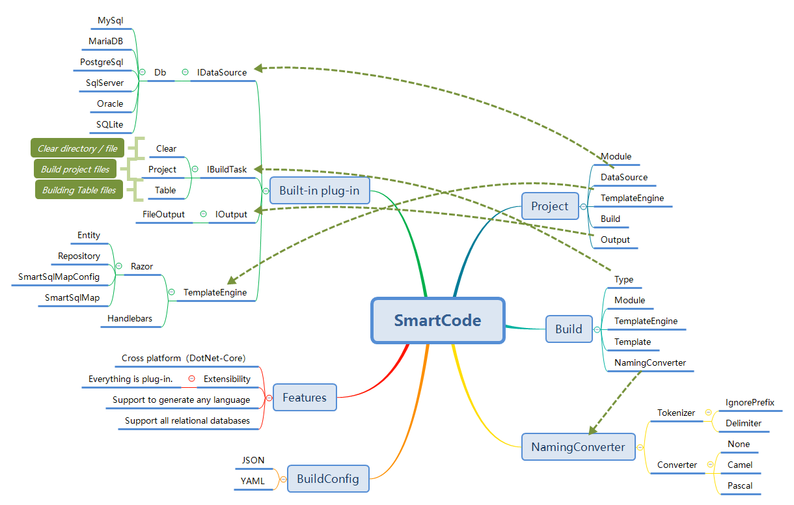

<p align="center">
  
</p>

# SmartCode([Chinese Document](./README.md))

> SmartCode = IDataSource -> IBuildTask -> IOutput => Build Everything

## Introduction



## Nuget Packages

| Package | NuGet Stable |  Downloads |
| ------- | -------- | ------- |
| [SmartCode.CLI](https://www.nuget.org/packages/SmartCode.CLI/) | [](https://www.nuget.org/packages/SmartCode.CLI/)  | [](https://www.nuget.org/packages/SmartCode.CLI/) |

## SmartCode.Generator (Code generator)

### Demo


### Getting Started

1. Install from .NET Core Global Tool  

  ``` shell
    dotnet tool install --global SmartCode.CLI
  ```

2. edit build configuration file (default: SmartCode.yml)
3. the command line executes the SmartCode command.
    - SmartCode
    - wait for prompt to enter the configuration file path (optional: SmartCode.yml file in the default program root directory)
    - carriage return execution command
4. wait for the end of the task execution.
5. View output directory results
6. run the API project and debug with Swagger.

### Building configuration files

``` yml
Module: SmartSql.Starter
Author: Ahoo Wang
DataSource:
  Name: DbTable
  Parameters:
    DbName: SmartSqlTestDB
    DbProvider: SqlServer
    ConnectionString: Data Source=.;Initial Catalog=SmartSqlTestDB;Integrated Security=True
Language: CSharp
TemplateEngine: 
   Name: Razor
   Root: CSharp
Output: 
  Type: File
  Path: 'E:\SmartSql-Starter'
Parameters:
  SmartSqlVersion: '4.0.46'
  SmartSqlSchemaVersion: '4.0.42'
  BuildDir: 'E:\SmartSql-Starter\build'
  DockerImage: 'smartsql.starter'
  
NamingConverter:
  Table:
    Tokenizer:
      Type: Default
      Parameters:
        IgnorePrefix: 'T_'
        Delimiter: '_'
    Converter:
      Type: Pascal
      Parameters: { }
  View:
    Tokenizer:
      Type: Default
      Parameters:
        IgnorePrefix: 'V_'
        Delimiter: '_'
    Converter:
      Type: Pascal
  Column:
    Tokenizer:
      Type: Default
      Parameters:
        Delimiter: '_'
    Converter:
      Type: Pascal

# 构建任务
Build:

#  ClearDir:
#    Type: Clear
#    Parameters:
#      Dirs: '.'

  MakeBuildDir:
    Type: Process
    Parameters:
      FileName: powershell
      Args: mkdir '{{Project.Parameters.BuildDir}}'
  Copy:
    Type: Process
    Parameters:
      FileName: powershell
      Args:  cp '{{Project.ConfigPath}}' '{{Project.Parameters.BuildDir}}'

  Scaffolding:
    Type: MultiTemplate
    Output: 
      Path: '.'
    Parameters:
      Templates: [{Key: 'Sln.cshtml',Output: {Name: '{{Project.Module}}',Extension: '.sln'}},
        {Key: 'Sln-Directory.Build.cshtml',Output: {Name: 'Directory.Build',Extension: '.props'}},
        {Key: 'Sln-Version.cshtml',Output: {Path: 'build',Name: 'version',Extension: '.props'}},
        {Key: 'Sln-Dockerfile.cshtml',Output: {Name: 'Dockerfile',Extension: ''}},
        {Key: 'Sln-DockerIgnore.cshtml',Output: {Name: '.dockerignore',Extension: ''}},
        {Key: 'Sln-GitIgnore.cshtml',Output: {Name: '.gitignore',Extension: ''}},
        {Key: "Proj-Entity.cshtml",Output: {Path: 'src/{{Project.Module}}.Entity',Name: '{{Project.Module}}.Entity',Extension: '.csproj'}},
        {Key: "Proj-Repository.cshtml",Output: {Path: 'src/{{Project.Module}}.Repository',Name: '{{Project.Module}}.Repository',Extension: '.csproj'}},
        {Key: "Proj-Service.cshtml",Output: {Path: 'src/{{Project.Module}}.Service',Name: '{{Project.Module}}.Service',Extension: '.csproj'}},
        {Key: "Proj-API.cshtml",Output: {Path: 'src/{{Project.Module}}.API',Name: '{{Project.Module}}.API',Extension: '.csproj'}},
        {Key: "API/LaunchSettings.cshtml",Output: {Path: 'src/{{Project.Module}}.API/Properties',Name: 'launchSettings',Extension: '.json'}},
        {Key: "API/AppSettings.cshtml",Output: {Path: 'src/{{Project.Module}}.API',Name: 'appsettings',Extension: '.json'}},
        {Key: "API/AppSettings-Development.cshtml",Output: {Path: 'src/{{Project.Module}}.API',Name: 'appsettings.Development',Extension: '.json'}},
        {Key: "API/Program.cshtml",Output: {Path: 'src/{{Project.Module}}.API',Name: 'Program',Extension: '.cs'}},
        {Key: "API/Startup.cshtml",Output: {Path: 'src/{{Project.Module}}.API',Name: 'Startup',Extension: '.cs'}},
        {Key: "API/APIException.cshtml",Output: {Path: 'src/{{Project.Module}}.API/Exceptions',Name: 'APIException',Extension: '.cs'}},
        {Key: "API/GlobalExceptionFilter.cshtml",Output: {Path: 'src/{{Project.Module}}.API/Filters',Name: 'GlobalExceptionFilter',Extension: '.cs'}},
        {Key: "API/GlobalValidateModelFilter.cshtml",Output: {Path: 'src/{{Project.Module}}.API/Filters',Name: 'GlobalValidateModelFilter',Extension: '.cs'}},
        {Key: "API/QueryRequest.cshtml",Output: {Path: 'src/{{Project.Module}}.API/Messages',Name: 'QueryRequest',Extension: '.cs'}},
        {Key: "API/QueryByPageRequest.cshtml",Output: {Path: 'src/{{Project.Module}}.API/Messages',Name: 'QueryByPageRequest',Extension: '.cs'}},
        {Key: "API/ResponseMessage.cshtml",Output: {Path: 'src/{{Project.Module}}.API/Messages',Name: 'ResponseMessage',Extension: '.cs'}},
        {Key: "API/QueryResponse.cshtml",Output: {Path: 'src/{{Project.Module}}.API/Messages',Name: 'QueryResponse',Extension: '.cs'}},
        {Key: "API/QueryByPageResponse.cshtml",Output: {Path: 'src/{{Project.Module}}.API/Messages',Name: 'QueryByPageResponse',Extension: '.cs'}},
        {Key: "API/ResponseMessage.cshtml",Output: {Path: 'src/{{Project.Module}}.API/Messages',Name: 'ResponseMessage',Extension: '.cs'}},
        {Key: "SqlMapConfig.cshtml",Output: {Path: 'src/{{Project.Module}}.Repository',Name: 'SmartSqlMapConfig',Extension: '.xml'}},
        {Key: "SqlMapConfig.cshtml",Output: {Path: 'src/{{Project.Module}}.Repository',Name: 'SmartSqlMapConfig.Development',Extension: '.xml'}}]

  Entity:
    Type: Table
    Module: Entity
    TemplateEngine: 
      Path: Entity.cshtml
    Output: 
      Path: 'src/{{Project.Module}}.{{Build.Module}}'
      Name: '{{Items.CurrentTable.ConvertedName}}'
      Extension: '.cs'

  Repository:
    Type: Table
    Module: Repository
    TemplateEngine: 
      Path: Repository.cshtml
    IgnoreNoPKTable: true
    IgnoreView: true
    Output: 
      Path: 'src/{{Project.Module}}.{{Build.Module}}'
      Name: 'I{{Items.CurrentTable.ConvertedName}}Repository'
      Extension: .cs

  Service:
    Type: Table
    Module: Service
    TemplateEngine: 
      Path: Service.cshtml
    IgnoreNoPKTable: true
    IgnoreView: true
    Output: 
      Path: 'src/{{Project.Module}}.{{Build.Module}}'
      Name: '{{Items.CurrentTable.ConvertedName}}Service'
      Extension: .cs

  APIController:
    Type: Table
    Module: API
    TemplateEngine: 
      Path: API/APIController.cshtml
    IgnoreNoPKTable: true
    IgnoreView: true
    Output: 
      Path: 'src/{{Project.Module}}.{{Build.Module}}/Controllers'
      Name: '{{Items.CurrentTable.ConvertedName}}Controller'
      Extension: .cs

  SqlMap:
    Type: Table
    TemplateEngine: 
      Path: SqlMap.cshtml
    Output: 
      Path: 'src/{{Project.Module}}.Repository/Maps'
      Name: '{{Items.CurrentTable.ConvertedName}}'
      Extension: .xml
    IgnoreNoPKTable: true
    IgnoreView: true

# Please install dotnet-format first!
# dotnet tool install -g dotnet-format
  CodeFormat:
    Type: Process
    Parameters:
      FileName: powershell
      WorkingDirectory: '{{Project.Output.Path}}'
      Args: dotnet-format

  ReStore:
    Type: Process
    Parameters: 
      FileName: powershell
      WorkingDirectory: '{{Project.Output.Path}}'
      Args: dotnet restore

#  BuildDocker:
#    Type: Process
#    Parameters: 
#      FileName: powershell
#      WorkingDirectory: '{{Project.Output.Path}}'
#      Args: docker build -t {{Project.Parameters.DockerImage}}:v1.0.0 .

#  RunDocker:
#    Type: Process
#    Parameters: 
#      FileName: powershell
#      WorkingDirectory: '{{Project.Output.Path}}'
#      Args: docker run --name {{Project.Parameters.DockerImage}} --rm -d -p 8008:80 {{Project.Parameters.DockerImage}}:v1.0.0 .

#  Publish:
#    Type: Process
#    Parameters: 
#      FileName: powershell
#      WorkingDirectory: '{{Project.Output.Path}}'
#      Args: dotnet publish -c Release -o '{{Project.Output.Path}}\publish'

#  Run:
#    Type: Process
#    Parameters: 
#      FileName: powershell
#      WorkingDirectory: '{{Project.Output.Path}}\publish'
#      CreateNoWindow: false
#      RedirectStandardOutput: false
#      RedirectStandardError: false
#      WaitForExit: false
#      WriteLines: ['dotnet {{Project.Module}}.API.dll']

#  RunChrome:
#    Type: Process
#    Parameters: 
#      FileName: C:\Program Files (x86)\Google\Chrome\Application\chrome.exe
#      CreateNoWindow: false
#      Args: http://localhost:8008/swagger
```

### Build file parameter overview

| Parameter Name | Description |
| :--------- | --------:|
| Module | Root Module Name |
| Author | Author |
| DataSource | Data Source |
| Language | Language: CSharp/Java/.... |
| TemplateEngine | Template Engine: Currently Built: Razor/Handlebars |
| Output | Output |
| Build | Task Build |

#### DataSource Data Source, Name: DbTable

> Property Name: DbTable, using the DbTableSource plugin as a data source

DbTableSource.Parameters accepts the following three parameters:

| Parameter Name | Description |
| :--------- | --------:|
| DbName | Database Name |
| DbProvider | Data Drivers: MySql, MariaDB, PostgreSql, SqlServer, Oracle, SQLite |
| ConnectionString | Connection String |

#### Build Task Build

| Parameter Name | Description |
| :--------- | --------:|
| Type | Build type, Clear: used to clean up the directory s / file s, Project: used to build a single file, such as: solution file / project file, Table: used to build a data table-based file, such as: Entity , Repository file|
| Module | Building Module Name |
| TemplateEngine | Template Engine, optional, default to root module engine |
| Template | Template File |
| Output | Output |
| IgnoreNoPKTable | Ignore no PK Table |
| IgnoreView | Ignore view |
| IncludeTables | Include table name s |
| IgnoreTables | Ignore table name s |
| NamingConverter | Named Converter |
| Parameters | Custom Build Parameters |

#### NamingConverter Name Conversion

| Attribute | Description |
| :--------- | --------:|
| Type | Table/View/Column |
| Tokenizer | Word Segmenter |
| Converter | Converter: Camel/Pascal/None |

##### NamingConverter.Tokenizer Word Segmenter

| Attribute | Description |
| :--------- | --------:|
| Type | Default |
| Parameters.IgnorePrefix | Ignore prefix characters |
| Parameters.Delimiter | Separator |
| Parameters.UppercaseSplit | Using uppercase separation, default: true |

### How to contribute a template

>In order to allow more people to participate in the construction of SmartCode templates, there are the following template specifications:

1. The template author creates a new directory in src/SmartCode.Generator/RazorTemplates and names it in the author's English name.
2. Place the template in the author directory
3. The README.md file must be included in the author directory to illustrate the purpose of the template and how it is used.
4. Submit PR

## SmartCode.ETL(Extract-Transform-Load)

### ETL Building configuration files

``` yml
Author: Ahoo Wang
DataSource:
  Name: Extract
  Parameters:
    DbProvider: SqlServer
    ConnectionString: Data Source=.;Initial Catalog=SmartSqlDB;Integrated Security=True
    Query: SELECT [Id],[UserName],[Pwd],[Status],[LastLoginTime],[CreationTime],[Deleted] FROM [T_User] Where Id>@LastMaxId And CreationTime>@LastQueryTime
    PKColumn: Id

Parameters:
  ETLCode: SmartCode.ETL.Test
  ETLRepository: PG
  
Build:

  Transform:
    Type: Transform
    Parameters:
      Script: Load2PostgreSql.cshtml

  Load2PostgreSql: 
    Type: Load
    Parameters:
      DbProvider: PostgreSql
      ConnectionString: Server=localhost;Port=5432;User Id=postgres;Password=SmartSql; Database=smartsql_db;
      Table: t_user
      ColumnMapping: [{Column: UserName,Mapping: user_name}
      ,{Column: Pwd,Mapping: pwd}
      ,{Column: Status,Mapping: status}
      ,{Column: LastLoginTime,Mapping: lastlogintime}
      ,{Column: CreationTime,Mapping: creationtime}
      ,{Column: Deleted,Mapping: deleted}]
      PreCommand: 
      PostCommand: 
```