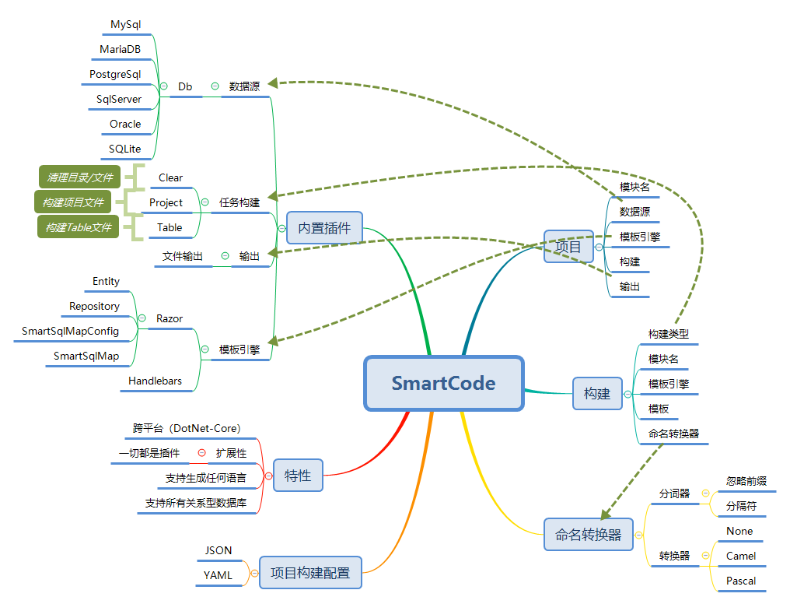
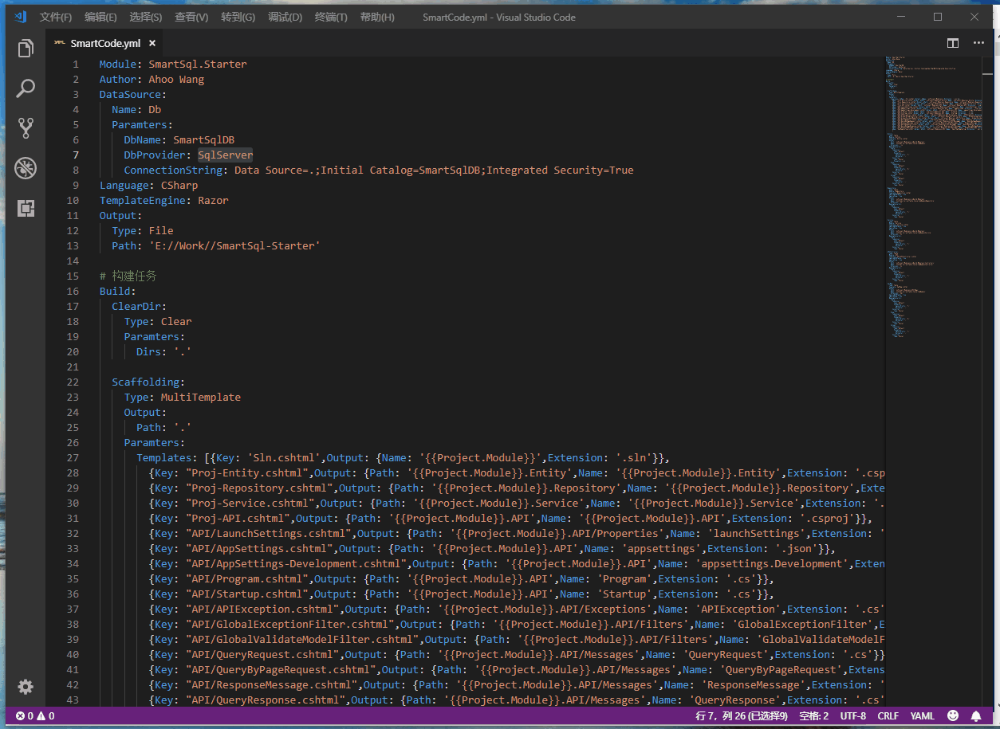

<p align="center">
  
</p>

# SmartCode([English Document](./README-EN.md))

> SmartCode = IDataSource -> IBuildTask -> IOutput => Build Everything

## Introduction



## Nuget Packages

| Package | NuGet Stable |  Downloads |
| ------- | -------- | ------- |
| [SmartCode.CLI](https://www.nuget.org/packages/SmartCode.CLI/) | [](https://www.nuget.org/packages/SmartCode.CLI/)  | [](https://www.nuget.org/packages/SmartCode.CLI/) |

## SmartCode.Generator (代码生成器)

### Demo



### Getting Started

1. Install from .NET Core Global Tool

  ``` shell
  dotnet tool install --global SmartCode.CLI
  ```

2. 编辑构建配置文件（默认：SmartCode.yml）
3. 命令行执行SmartCode命令
    - SmartCode
    - 等待提示输入配置文件路径（可选：默认程序根目录下SmartCode.yml文件）
    - 回车执行命令
4. 等待任务执行结束
5. 查看输出目录结果
6. 运行API项目，进行Swagger调试

### 构建配置文件

``` yml
Module: SmartSql.Starter
Author: Ahoo Wang
DataSource:
  Name: DbTable
  Parameters:
    DbName: SmartSqlTestDB
    DbProvider: SqlServer
    ConnectionString: Data Source=.;Initial Catalog=SmartSqlTestDB;Integrated Security=True
Language: CSharp
TemplateEngine: 
   Name: Razor
   Root: CSharp
Output: 
  Type: File
  Path: 'E:\SmartSql-Starter'
Parameters:
  SmartSqlVersion: '4.1.64'
  SmartSqlSchemaVersion: '4.1.30'
  BuildDir: 'E:\SmartSql-Starter\build'
  DockerImage: 'smartsql.starter'
  
NamingConverter:
  Table:
    Tokenizer:
      Type: Default
      Parameters:
        IgnorePrefix: 'T_'
        Delimiter: '_'
    Converter:
      Type: Pascal
      Parameters: { }
  View:
    Tokenizer:
      Type: Default
      Parameters:
        IgnorePrefix: 'V_'
        Delimiter: '_'
    Converter:
      Type: Pascal
  Column:
    Tokenizer:
      Type: Default
      Parameters:
        Delimiter: '_'
    Converter:
      Type: Pascal

# 构建任务
Build:

#  ClearDir:
#    Type: Clear
#    Parameters:
#      Dirs: '.'

  MakeBuildDir:
    Type: Process
    Parameters:
      FileName: powershell
      Args: mkdir '{{Project.Parameters.BuildDir}}'
  Copy:
    Type: Process
    Parameters:
      FileName: powershell
      Args:  cp '{{Project.ConfigPath}}' '{{Project.Parameters.BuildDir}}'

  Scaffolding:
    Type: MultiTemplate
    Output: 
      Path: '.'
    Parameters:
      Templates: [{Key: 'Sln.cshtml',Output: {Name: '{{Project.Module}}',Extension: '.sln'}},
        {Key: 'Sln-Directory.Build.cshtml',Output: {Name: 'Directory.Build',Extension: '.props'}},
        {Key: 'Sln-Version.cshtml',Output: {Path: 'build',Name: 'version',Extension: '.props'}},
        {Key: 'Sln-Dockerfile.cshtml',Output: {Name: 'Dockerfile',Extension: ''}},
        {Key: 'Sln-DockerIgnore.cshtml',Output: {Name: '.dockerignore',Extension: ''}},
        {Key: 'Sln-GitIgnore.cshtml',Output: {Name: '.gitignore',Extension: ''}},
        {Key: "Proj-Entity.cshtml",Output: {Path: 'src/{{Project.Module}}.Entity',Name: '{{Project.Module}}.Entity',Extension: '.csproj'}},
        {Key: "Proj-Repository.cshtml",Output: {Path: 'src/{{Project.Module}}.Repository',Name: '{{Project.Module}}.Repository',Extension: '.csproj'}},
        {Key: "Proj-Service.cshtml",Output: {Path: 'src/{{Project.Module}}.Service',Name: '{{Project.Module}}.Service',Extension: '.csproj'}},
        {Key: "Proj-API.cshtml",Output: {Path: 'src/{{Project.Module}}.API',Name: '{{Project.Module}}.API',Extension: '.csproj'}},
        {Key: "API/LaunchSettings.cshtml",Output: {Path: 'src/{{Project.Module}}.API/Properties',Name: 'launchSettings',Extension: '.json'}},
        {Key: "API/AppSettings.cshtml",Output: {Path: 'src/{{Project.Module}}.API',Name: 'appsettings',Extension: '.json'}},
        {Key: "API/AppSettings-Development.cshtml",Output: {Path: 'src/{{Project.Module}}.API',Name: 'appsettings.Development',Extension: '.json'}},
        {Key: "API/Program.cshtml",Output: {Path: 'src/{{Project.Module}}.API',Name: 'Program',Extension: '.cs'}},
        # {Key: "API/Startup.cshtml",Output: {Path: 'src/{{Project.Module}}.API',Name: 'Startup',Extension: '.cs'}},
        {Key: "API/APIException.cshtml",Output: {Path: 'src/{{Project.Module}}.API/Exceptions',Name: 'APIException',Extension: '.cs'}},
        {Key: "API/GlobalExceptionFilter.cshtml",Output: {Path: 'src/{{Project.Module}}.API/Filters',Name: 'GlobalExceptionFilter',Extension: '.cs'}},
        {Key: "API/GlobalValidateModelFilter.cshtml",Output: {Path: 'src/{{Project.Module}}.API/Filters',Name: 'GlobalValidateModelFilter',Extension: '.cs'}},
        {Key: "API/QueryRequest.cshtml",Output: {Path: 'src/{{Project.Module}}.API/Messages',Name: 'QueryRequest',Extension: '.cs'}},
        {Key: "API/QueryByPageRequest.cshtml",Output: {Path: 'src/{{Project.Module}}.API/Messages',Name: 'QueryByPageRequest',Extension: '.cs'}},
        {Key: "API/ResponseMessage.cshtml",Output: {Path: 'src/{{Project.Module}}.API/Messages',Name: 'ResponseMessage',Extension: '.cs'}},
        {Key: "API/QueryResponse.cshtml",Output: {Path: 'src/{{Project.Module}}.API/Messages',Name: 'QueryResponse',Extension: '.cs'}},
        {Key: "API/QueryByPageResponse.cshtml",Output: {Path: 'src/{{Project.Module}}.API/Messages',Name: 'QueryByPageResponse',Extension: '.cs'}},
        {Key: "API/ResponseMessage.cshtml",Output: {Path: 'src/{{Project.Module}}.API/Messages',Name: 'ResponseMessage',Extension: '.cs'}},
        {Key: "SqlMapConfig.cshtml",Output: {Path: 'src/{{Project.Module}}.Repository',Name: 'SmartSqlMapConfig',Extension: '.xml'}},
        {Key: "SqlMapConfig.cshtml",Output: {Path: 'src/{{Project.Module}}.Repository',Name: 'SmartSqlMapConfig.Development',Extension: '.xml'}}]

  Entity:
    Type: Table
    Module: Entity
    TemplateEngine: 
      Path: Entity.cshtml
    Output: 
      Path: 'src/{{Project.Module}}.{{Build.Module}}'
      Name: '{{Items.CurrentTable.ConvertedName}}'
      Extension: '.cs'

  Repository:
    Type: Table
    Module: Repository
    TemplateEngine: 
      Path: Repository.cshtml
    IgnoreNoPKTable: true
    IgnoreView: true
    Output: 
      Path: 'src/{{Project.Module}}.{{Build.Module}}'
      Name: 'I{{Items.CurrentTable.ConvertedName}}Repository'
      Extension: .cs

  Service:
    Type: Table
    Module: Service
    TemplateEngine: 
      Path: Service.cshtml
    IgnoreNoPKTable: true
    IgnoreView: true
    Output: 
      Path: 'src/{{Project.Module}}.{{Build.Module}}'
      Name: '{{Items.CurrentTable.ConvertedName}}Service'
      Extension: .cs

  APIController:
    Type: Table
    Module: API
    TemplateEngine: 
      Path: API/APIController.cshtml
    IgnoreNoPKTable: true
    IgnoreView: true
    Output: 
      Path: 'src/{{Project.Module}}.{{Build.Module}}/Controllers'
      Name: '{{Items.CurrentTable.ConvertedName}}Controller'
      Extension: .cs

  SqlMap:
    Type: Table
    TemplateEngine: 
      Path: SqlMap.cshtml
    Output: 
      Path: 'src/{{Project.Module}}.Repository/Maps'
      Name: '{{Items.CurrentTable.ConvertedName}}'
      Extension: .xml
    IgnoreNoPKTable: true
    IgnoreView: true

  AddEntityProj:
    Type: Process
    Parameters: 
      FileName: powershell
      WorkingDirectory: '{{Project.Output.Path}}'
      Args: dotnet sln add -s API src/{{Project.Module}}.Entity/{{Project.Module}}.Entity.csproj

  AddRepositryProj:
    Type: Process
    Parameters: 
      FileName: powershell
      WorkingDirectory: '{{Project.Output.Path}}'
      Args: dotnet sln add -s API src/{{Project.Module}}.Repository/{{Project.Module}}.Repository.csproj

  AddServiceProj:
    Type: Process
    Parameters: 
      FileName: powershell
      WorkingDirectory: '{{Project.Output.Path}}'
      Args: dotnet sln add -s API src/{{Project.Module}}.Service/{{Project.Module}}.Service.csproj

  AddApiProj:
    Type: Process
    Parameters: 
      FileName: powershell
      WorkingDirectory: '{{Project.Output.Path}}'
      Args: dotnet sln add -s API src/{{Project.Module}}.API/{{Project.Module}}.API.csproj

# Please install dotnet-format first!
# dotnet tool install -g dotnet-format
  CodeFormat:
    Type: Process
    Parameters:
      FileName: powershell
      WorkingDirectory: '{{Project.Output.Path}}'
      Args: dotnet-format

  ReStore:
    Type: Process
    Parameters: 
      FileName: powershell
      WorkingDirectory: '{{Project.Output.Path}}'
      Args: dotnet restore

#  BuildDocker:
#    Type: Process
#    Parameters: 
#      FileName: powershell
#      WorkingDirectory: '{{Project.Output.Path}}'
#      Args: docker build -t {{Project.Parameters.DockerImage}}:v1.0.0 .

#  RunDocker:
#    Type: Process
#    Parameters: 
#      FileName: powershell
#      WorkingDirectory: '{{Project.Output.Path}}'
#      Args: docker run --name {{Project.Parameters.DockerImage}} --rm -d -p 8008:80 {{Project.Parameters.DockerImage}}:v1.0.0 .

#  Publish:
#    Type: Process
#    Parameters: 
#      FileName: powershell
#      WorkingDirectory: '{{Project.Output.Path}}'
#      Args: dotnet publish -c Release -o '{{Project.Output.Path}}\publish'

#  Run:
#    Type: Process
#    Parameters: 
#      FileName: powershell
#      WorkingDirectory: '{{Project.Output.Path}}\publish'
#      CreateNoWindow: false
#      RedirectStandardOutput: false
#      RedirectStandardError: false
#      WaitForExit: false
#      WriteLines: ['dotnet {{Project.Module}}.API.dll']

#  RunChrome:
#    Type: Process
#    Parameters: 
#      FileName: C:\Program Files (x86)\Google\Chrome\Application\chrome.exe
#      CreateNoWindow: false
#      Args: http://localhost:8008/swagger
```

### 构建文件参数概览

| 参数名 | 说明 |
| :--------- | --------:|
| Module | 根模块名 |
| Author | 作者 |
| DataSource | 数据源 |
| Language | 语言：CSharp/Java/.... |
| TemplateEngine | 模板引擎：目前内置：Razor |
| Output | 输出 |
| Build | 任务构建s |

#### DataSource 数据源，Name:DbTable

> 属性 Name:DbTable,使用 DbTableSource 插件作为数据源

DbTableSource.Parameters 接受以下三个参数：

| 参数名 | 说明 |
| :--------- | --------:|
| DbName | 数据库名称 |
| DbProvider | 数据驱动提供者:MySql,MariaDB,PostgreSql,SqlServer,Oracle,SQLite |
| ConnectionString | 连接字符串 |

#### Output 输出

| 参数名 | 说明 |
| :--------- | --------:|
| Type | File |
| Path | 输出目录 |
| Name | 文件名 |
| Extension | 扩展名 |
| Mode | 输出模式，默认：Incre。Incre:增量创建，如果文件存在则忽略 。Full：全量创建，如果存在则重新创建 |

#### Build 任务构建

| 参数名 | 说明 |
| :--------- | --------:|
| Type | 构建类型,Clear:用于清理目录s/文件s, Project:用于构建单文件，如：解决方案文件/项目文件, MultiTemplate:多模板构建多个文件, Table: 用于构建以数据表为基础的文件，如：Entity,Repository文件, Process: 启动新进程|
| Module | 构建模块名 |
| TemplateEngine | 模板引擎，可选，默认使用根模块引擎 |
| Template | 模板文件 |
| Output | 输出 |
| IgnoreNoPKTable | 忽略无主键表 |
| IgnoreView | 忽略视图 |
| IncludeTables | 包括表名s |
| IgnoreTables | 忽略表名s |
| NamingConverter | 命名转换器 |
| Parameters | 自定义构建参数 |

#### NamingConverter 命名转换

| 属性 | 说明 |
| :--------- | --------:|
| 类型 | Table/View/Column |
| Tokenizer | 分词器 |
| Converter | 转换器：Camel/Pascal/None |

##### NamingConverter.Tokenizer 分词器

| 属性 | 说明 |
| :--------- | --------:|
| Type | Default |
| Parameters.IgnorePrefix | 忽略前缀字符 |
| Parameters.Delimiter | 分隔符 |
| Parameters.UppercaseSplit | 使用大写分隔，默认：true |

### 如何贡献模板

>为了让更多人参与到SmartCode模板建设中来，故有以下模板规范：

1. 模板作者在 src/SmartCode.Generator/RazorTemplates/Contributions 中新建目录，并以作者英文名为目录名称
2. 把模板放置到作者目录
3. 作者目录下必须包括 README.md 文件，以说明模板的用途场景以及使用方式
4. 提交PR

## SmartCode.ETL(Extract-Transform-Load)（[SmartCode.ETL-Doc](./doc/SmartCode.ETL.md)）

### ETL 构建配置

``` yml
Author: Ahoo Wang
DataSource:
  Name: Extract
  Parameters:
    DbProvider: SqlServer
    ConnectionString: Data Source=.;Initial Catalog=SmartSqlDB;Integrated Security=True
    Query: SELECT [Id],[UserName],[Pwd],[Status],[LastLoginTime],[CreationTime],[Deleted] FROM [T_User] Where Id>@LastMaxId And CreationTime>@LastQueryTime
    PKColumn: Id

Parameters:
  ETLCode: SmartCode.ETL.Test
  ETLRepository: PG
  
Build:

  Transform:
    Type: Transform
    Parameters:
      Script: Load2PostgreSql.cshtml

  Load2PostgreSql: 
    Type: Load
    Parameters:
      DbProvider: PostgreSql
      ConnectionString: Server=localhost;Port=5432;User Id=postgres;Password=SmartSql; Database=smartsql_db;
      Table: t_user
      ColumnMapping: [{Column: UserName,Mapping: user_name}
      ,{Column: Pwd,Mapping: pwd}
      ,{Column: Status,Mapping: status}
      ,{Column: LastLoginTime,Mapping: lastlogintime}
      ,{Column: CreationTime,Mapping: creationtime}
      ,{Column: Deleted,Mapping: deleted}]
      PreCommand: 
      PostCommand: 
```
