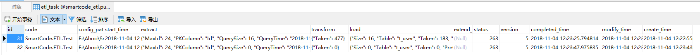

# SmartCode support ETL !

> Following the 2018-10-04 SmartCode official version (SmartCode.Generator) released, SmartCode ushered in a new capability SmartCode.ETL!

> The official version of SmartCode has never said that it is just a code generator since its inception. This is the first time I announced the official open source article of SmartCode: "SmartCode is not just a code generator", it is more than just A promotion!

## SmartCode.Generator

I believe many of my classmates have used various code generators. I will not go into details here. If you want to experience SmartCode.Generator, please go to <https://github.com/Ahoo-Wang/SmartCode/blob/master/README-EN.md> Configure database connections and generate solutions with one click.

## Why SmartCode.ETL

I believe that many students who have already landed the microservices architecture plan will encounter the same problem:

1. The query requirements of the business side always seem to cross the microservice DB.
2. The report data that the leadership needs to view is always global (need to be aggregated across the microservice DB)

## So SmartCode.ETL

1. Synchronize business aggregate query data from multiple microservices DBs to all_biz DB (Resolve: The microservice architecture must meet the problem that the business side needs to query across the microservice DB)
2. Synchronously aggregate analysis data from all_biz DB to report DB (Resolve: Report data aggregation problem viewed by the leader)

## How SmartCode.ETL

1. Install SmartCode from dotnet-cli

   ``` powershell
   dotnet tool install --global SmartCode.CLI
   ```

2. Use SmartCode.Generator to generate a synchronous Sql table structure script, and SmartCode.ETL build configuration
3. Execute the Sql synchronization script to initialize the table structure
4. Synchronize data using task scheduling (crontab) + SmartCode.ETL
5. Monitor etl execution by persisting etl_task (currently supports PostgreSql)

> Simply put, SmartCode generates SmartCode, and task scheduling executes the SmartCode command line. (This is really not a problem with chicken or egg first.....)

## SmartCode Plugin Overview

``` json
{
  "SmartCode": {
    "Version": "v1.16.15",
    "Plugins": [
      {
        "Type": "SmartCode.IDataSource,SmartCode",
        "ImplType": "SmartCode.NoneDataSource,SmartCode"
      },
      {
        "Type": "SmartCode.IBuildTask,SmartCode",
        "ImplType": "SmartCode.App.BuildTasks.ClearBuildTask,SmartCode.App"
      },
      {
        "Type": "SmartCode.IBuildTask,SmartCode",
        "ImplType": "SmartCode.App.BuildTasks.ProjectBuildTask,SmartCode.App"
      },
      {
        "Type": "SmartCode.IBuildTask,SmartCode",
        "ImplType": "SmartCode.App.BuildTasks.MultiTemplateBuildTask,SmartCode.App"
      },
      {
        "Type": "SmartCode.IBuildTask,SmartCode",
        "ImplType": "SmartCode.App.BuildTasks.ProcessBuildTask,SmartCode.App"
      },
      {
        "Type": "SmartCode.IOutput,SmartCode",
        "ImplType": "SmartCode.App.Outputs.FileOutput,SmartCode.App"
      },
      {
        "Type": "SmartCode.IDataSource,SmartCode",
        "ImplType": "SmartCode.Generator.DbTableSource,SmartCode.Generator"
      },
      {
        "Type": "SmartCode.IBuildTask,SmartCode",
        "ImplType": "SmartCode.Generator.BuildTasks.TableBuildTask,SmartCode.Generator"
      },
      {
        "Type": "SmartCode.IBuildTask,SmartCode",
        "ImplType": "SmartCode.Generator.BuildTasks.SingleBuildTask,SmartCode.Generator"
      },
      {
        "Type": "SmartCode.INamingConverter,SmartCode",
        "ImplType": "SmartCode.Generator.TableNamingConverter,SmartCode.Generator"
      },
      {
        "Type": "SmartCode.TemplateEngine.ITemplateEngine,SmartCode.TemplateEngine",
        "ImplType": "SmartCode.TemplateEngine.Impl.RazorCoreTemplateEngine,SmartCode.TemplateEngine"
      },
      {
        "Type": "SmartCode.Generator.IDbTypeConverter,SmartCode.Generator",
        "ImplType": "SmartCode.Generator.DbTypeConverter.DefaultDbTypeConverter,SmartCode.Generator"
      },
      {
        "Type": "SmartCode.IDataSource,SmartCode",
        "ImplType": "SmartCode.ETL.ExtractDataSource,SmartCode.ETL"
      },
      {
        "Type": "SmartCode.IBuildTask,SmartCode",
        "ImplType": "SmartCode.ETL.BuildTasks.TransformBuildTask,SmartCode.ETL"
      },
      {
        "Type": "SmartCode.ETL.ITransformEngine,SmartCode.ETL",
        "ImplType": "SmartCode.ETL.TransformEngine.RazorTransformEngine,SmartCode.ETL"
      },
      {
        "Type": "SmartCode.IBuildTask,SmartCode",
        "ImplType": "SmartCode.ETL.BuildTasks.LoadBuildTask,SmartCode.ETL"
      },
      {
        "Type": "SmartCode.ETL.IETLRepository,SmartCode.ETL",
        "ImplType": "SmartCode.ETL.NoneETLRepository,SmartCode.ETL"
      },
      {
        "Type": "SmartCode.ETL.IETLRepository,SmartCode.ETL",
        "ImplType": "SmartCode.ETL.PostgreSql.PGETLRepository,SmartCode.ETL.PostgreSql",
        "Parameters": {
          "ConnectionString": "Server=localhost;Port=5432;User Id=postgres;Password=SmartSql; Database=smartcode_etl;"
        }
      }
    ]
  }
}

```

## ETL build configuration

``` yml
Author: Ahoo Wang
DataSource:
  Name: Extract
  Parameters:
    DbProvider: SqlServer
    ConnectionString: Data Source=.;Initial Catalog=SmartSqlDB;Integrated Security=True
    Query: SELECT [Id],[UserName],[Status],[LastLoginTime],[CreationTime],[ModifyTime],[Deleted] FROM [T_User] With(NoLock) Where ModifyTime>@LastMaxModifyTime
    PKColumn: Id
    AutoIncrement: true
    ModifyTime: ModifyTime
Parameters:
  ETLCode: SmartCode.ETL.Test
  ETLRepository: PG
Build:
  Transform:
    Type: Transform
    Parameters:
      Script: 
  Load2PostgreSql: 
    Type: Load
    Parameters:
      DbProvider: PostgreSql
      ConnectionString: Server=localhost;Port=5432;User Id=postgres;Password=SmartSql; Database=smartsql_db;
      Table: t_user__temp
      PreCommand: CREATE TABLE t_user__temp( LIKE t_user );
      PostCommand: "Delete From t_user as source Where EXISTS(select * from t_user__temp temp where temp.id=source.id);
      Insert Into t_user  SELECT * From t_user__temp;
      Drop Table t_user__temp;
      "
      ColumnMapping: [{Column: Id,Mapping: id}
      ,{Column: UserName,Mapping: user_name}
      ,{Column: Status,Mapping: status}
      ,{Column: LastLoginTime,Mapping: last_login_time}
      ,{Column: CreationTime,Mapping: creation_time}
      ,{Column: ModifyTime,Mapping: modify_time}
      ,{Column: Deleted,Mapping: deleted}]
```

### Root Parameters

| Parameter Name | Description |
| :------------ | -----------------------------: |
| ETLCode | ETL Task Code, distinguishing task types, unique |
| ETLRepository | ETL Task Persistence Repository, None/PG/SQLite |

### DataSource Parameter Description

> Attribute Name:Extract, using the ExtractDataSource plugin as a data source

#### ExtractDataSource.Parameters

| Parameter Name | Description |
| :--------------- | -------------------------------- |
| DbProvider | Data Drivers: MySql, MariaDB, PostgreSql, SqlServer, Oracle, SQLite |
| ConnectionString | Connection String |
| Query | Query command, data that needs to be extracted. By default, three parameters are automatically injected, LastMaxId, LastMaxModifyTime, and LastQueryTime as query conditions.|
| PKColumn | Primary Key Column Name |
AutoIncrement | Whether to auto-increment the primary key, true automatically calculates the extracted maximum primary key value (MaxId) |
| ModifyTime | Last modified time column name, set the maximum modified time column for custom calculations (MaxModifyTime) |

### Build.Load Parameter Description

> Attribute Type:Load, using the LoadBuildTask plugin as a build task

#### Build.Load.Parameters

| Parameter Name | Description |
| :--------------- | --------------------------------  |
| DbProvider | Data Drivers: MySql, MariaDB, PostgreSql, SqlServer, Oracle, SQLite |
| ConnectionString | Connection String |
| Table | Target Table Name |
| PreCommand | Commands executed before bulk insert tasks |
| PostCommand | Commands executed after a bulk insert task |
| ColumnMapping | Column Mapping |

## Synchronization strategy

### LastMaxId

LastMaxId is the maximum Id value of the last data extracted (LastMaxId is -1 for the first extraction). This mode is used for data tables that are not changed after data insertion.

### LastMaxModifyTime

LastMaxModifyTime is the maximum ModifyTime value of the last data extracted (LastMaxModifyTime is 1970-01-01 08:00:00 in the first extraction), and is applicable to the data table that will be changed after the data is inserted.

### Concurrent task synchronization

1. Take mode on Id, split different tasks, and execute concurrently

### Big data volume synchronization

1. Use Top/Limit to limit the number of data extractions and perform the entire data synchronization in multiple simultaneous executions.

### ETL_Task Task Monitoring



#### Performance Monitoring

##### Operating Environment

1. Source extraction library: Windows Server 2012, 8 vCPU 16 GB + SSD + SqlServer-2014
2. Target Analysis Library: CentOS-7, 8 vCPU 16 GB + SSD + PostgreSql-11 + SmartCode

##### ETL_Task.Extract

The following is the data extraction performance, the number of extraction is 1434678, which takes 41267 milliseconds.

``` json
{
    "MaxId": 1755822,
    "PKColumn": "Id",
    "QuerySize": 1434678,
    "QueryTime": "2018-11-01T11:31:53.6191084+08:00",
    "QueryCommand": {
        "Taken": 41267,
        "Command": "Select * From T_ProductSearchLog  With(NoLock) Where Id>@LastMaxId",
        "Parameters": {
            "LastMaxId": -1,
            "LastQueryTime": "1970-01-01T08:00:00"
        }
    }
}
```

##### ETL_Task.Load

The following is the data loading performance, the amount of bulk insert data is 1434678, which takes 21617 milliseconds, and inserts an average of 65759.6 data per second.

``` json
{
    "Size": 1434678,
    "Table": "t_product_search_log",
    "Taken": 21817,
    "PreCommand": null,
    "PostCommand": null
}
```

------

At present, SmartCode.ETL has been put into our production environment (2018-11-01 went online, as of 2018-11-16 16:50 executed 65520 synchronization tasks, no error log was thrown
)

> PS: Although SmartCode.ETL only took two days to complete the expansion on the weekend, it can already meet at least 90% of our application scenarios. This is enough to see how amazing the SmartCode expansion capabilities are. Of course, other capabilities of SmartCode have to be followed up and explored! ! !
